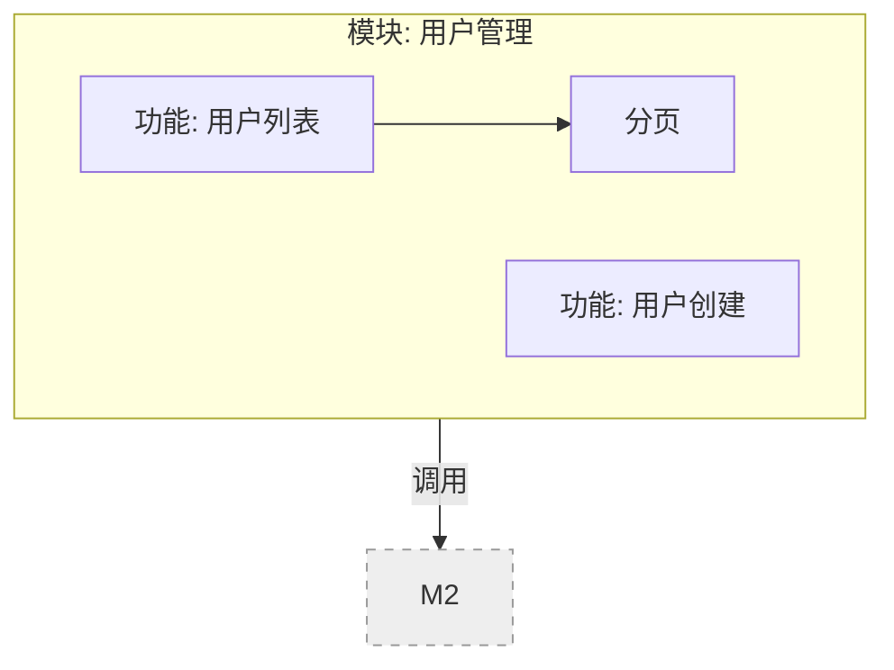
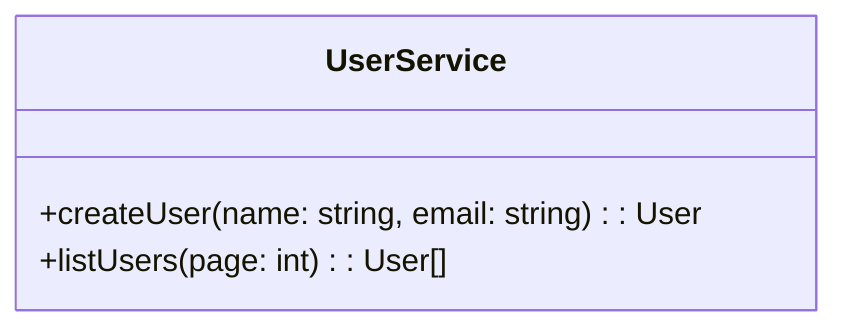

# SDD v0.4 双轨制升级 — 技术设计文档

> 对应变更：`openspec/changes/sdd-v04-dual-track/`
> 状态：设计定稿（brainstorm 11 项原始决策 Q1-Q11 + 审查修订 Q12-Q14 共 14 项已全部确认）

---

## 1. 目标与问题

**问题**：v0.3.3 的 S/M/L 三条文档路径无法同时满足两类需求——小 bug/细小改动要求 10-15 分钟闭环，而复杂需求要求交付功能架构图、函数声明图、函数调用关系、测试用例。前者被 3 份文档拖慢，后者缺图形化交付物、缺独立测试矩阵。

**核心转变**：从"按复杂度给三条文档路径"改为"**按需求形态给两条轨道**"，且重轨产物从"评审文档"升级为"编码与测试的输入契约"。

```
                    ┌── 轻轨 (目标 ≤ 15 min)
 用户需求 ── 分流 ──┤      /sdd-hotfix  — bug 修复 / 细小改动（新增）
                    │      /sdd-quick    — 小型新功能（轻量化改造）
                    │
                    └── 重轨 (完整详细)
                         小/中：propose → analyze → plan → code → verify → ship
                         大/复杂：brainstorm → propose → analyze → review-spec
                                   → plan → code → review-code → verify → ship
```

**分流逻辑**（Q5）：入口即分流——用户直接选入口命令。拿不准时跑 `/sdd-doctor` 获推荐。轻轨内置升轨保险丝：执行中发现复杂度超标（跨模块、动公共接口、需设计决策、改动量超盒）→ 暂停、保留半成品、给出"继续硬做/升轨/先提交"选项。

**判定依据**统一放 `openspec/config.yaml` 的 `limits` 节。

---

## 2. 轻轨 A：`/sdd-hotfix`（新增 action）

### 2.1 定位与认知模型

针对"改 bug / 细小改动"。认知模型是**调试**而非规格：先定位根因，再最小修复。产物收敛到 1 份 `hotfix.md` 卡片，**不生成** proposal/spec/tasks。

### 2.2 执行流程（≤15 分钟，每步一屏输出）

> **判定原则**：所有升降轨/停止判定使用**可机械判定的代理指标**（轮次/文件数/场景数），分钟数仅用于预估告知与卡片事后记录。

| 步骤 | 内容 | 升降轨判据（代理指标） |
|------|------|-----------|
| 0. 入口判定 | 是否真 hotfix？涉及新领域建模/跨模块重构 → 建议升轨 `/sdd-propose` | 不可 hotfix 信号命中即拒绝 |
| 1. 预估告知 | 根据现象先给预估："预期约 X 分钟（改动 ≤2 文件 + 回归测试）" | —（仅告知，不判定） |
| 2. 定位 | 复现 → 二分定位根因（委托 systematic-debugging 精简版） | 尝试达 N 轮（默认 3，limits 可配置）仍未定位 → 提示升轨 |
| 3. 修复确认 | 陈述根因 + 最小改动方案，**一行确认后动手** | — |
| 4. 最小修复 + 测试 | 改代码 + 补/跑回归测试（TDD 紧凑循环） | — |
| 5. 提交 | 单一 commit，message 前缀 `hotfix(<name>):` | — |
| 6. 卡片留痕 | 写 `hotfix.md`（含 track 头部元数据） | — |

**升轨豁免**：选项②升轨时单一 commit 约束豁免，已改部分可先提交。**升轨前置**：已定位的根因/方案先落盘 hotfix.md，避免 /clear 丢失。

### 2.3 hotfix.md 卡片（模板见 §7.2）

```markdown
---
track: hotfix
---
# Hotfix — <变更名称>
> 时间: YYYY-MM-DD | 预估/实际: X min / X min（事后记录，不作判定） | 分类: bugfix|minor

## 现象
<用户报告的现象 / 失败场景>

## 根因
<1-2 句根因定位，含 文件:行>

## 修复
- <文件路径> — <改了什么，为什么>
- 影响范围: <哪些既有行为被触碰>

## 验证
- 命令: <复现命令 / 测试命令>
- 结果: ✅ 通过（回归测试 N 个）
- 未覆盖: <明确未覆盖的边界>

## 衍生
- 新需求? 无 | 延后项: <如 >→ 记入 backlog
```

### 2.4 工作量盒（hotfix 盒）

- **盒**：改动 ≤ 2 个源文件 + 回归/新增测试 ≤ 3 个场景。
- **盒满即停**：超盒 → 输出"超出轻轨边界"，**先把根因/方案落盘 hotfix.md**，保留产物，让用户选 ①继续硬做（附风险）②升轨 `/sdd-propose`（单一 commit 豁免）③先提交已改部分。
- **不可 hotfix 的信号**：改公共接口签名 / 跨 2+ 模块 / 需迁移数据 / 需设计决策 → 直接拒绝并引导升轨。
- **盒边界优先级**：与 limits 配置冲突时取严（先达到者触发）。
- **生命周期**：卡片即终态；ship 走轻量归档豁免；continue/ff/verify 检测到 hotfix change 时降级引导，不强行补齐产物。

---

## 3. 轻轨 B：`/sdd-quick` 轻量化改造

- 保留"一站式小新功能"定位（规格思维：propose + spec + tasks + code）。
- **文档收敛**：默认 1 个 domain spec + 3-5 场景 + ≤6 任务（原 5 场景/10 任务），引用精简版 spec 格式（skills/sdd-quick/spec-compact.md）降低书写成本。
- proposal 头部带 `track: quick` 元数据；触发词"小修复/改 bug"引导至 /sdd-hotfix。
- 与 hotfix 对齐的机制：预估告知 + quick 工作量盒（≤3 源文件）+ 升轨保险丝。
- 复用 `limits` 节配置，旧值作为上限保留，可配置回原值。

---

## 4. 重轨升级：`sdd-analyze` → 蓝图 + 三图

### 4.1 functions.md 五段结构

| 段 | 形式 | 内容 |
|----|------|------|
| ① 功能架构图 | `mermaid flowchart` | 模块→功能层级 + 模块间调用/数据流边（**新增**） |
| ② 模块结构 | ASCII 树（保留） | 机器可读，供 plan/code 引用 |
| ③ 函数声明图 | `mermaid classDiagram` | **只画新增/修改函数**，含签名、归属模块（Q4） |
| ④ 函数签名表 | 结构化文本（保留） | 函数名/参数/返回值/描述 |
| ⑤ 调用关系图 | `mermaid flowchart` | 相关完整调用链；存量节点灰色虚线标注、不展开（Q4） |

**函数批次归属（A2 修订）**：analyze 阶段只写占位 `批次: <plan 阶段回填>`；**批次编号由 sdd-plan 分配并回写 functions.md**，被后续批次修改标 `(M)`。回写版是 code 切片三件套的唯一契约来源。

**Mermaid 图置于文档中段**，统一命名约定：`architecture-<module>` / `functions-<module>` / `calls-<module>`，便于引用与切片。

### 4.2 schema 状态变化

- `sdd-analyze` 升级为**重轨必需 step**（M/L 级必经，口径统一），位置：proposal → analyze → plan。
- `functions.md` 依赖 proposal，供 plan/code 消费（位置不变）。
- 质量门新增：mermaid **结构化静态检查**（代码块存在 + 命名约定 architecture-*/functions-*/calls-* + 无孤立节点/循环依赖），**不做渲染级校验**（不引入画图工具链）。

### 4.3 契约消费方

- `sdd-plan`：划分批次（依赖拓扑），**回写 functions.md 批次归属**；禁止用例引用未完成批次的函数；生成 test-cases.md。
- `sdd-code`：切片加载 + 批次校验（见 §6）。

---

## 5. 重轨产物：`test-cases.md`（独立测试矩阵）

**新增独立产物**，plan 阶段生成（从 TDD 步骤汇总去重）、verify 阶段回填状态。模板见 §7.3。

```markdown
# Test Cases: <变更名称>

| # | Spec 场景 | 测试文件 | 用例名 | 描述 | 输入 (GIVEN) | 预期 (THEN) | 状态 |
|---|-----------|---------|--------|------|-------------|-------------|------|
| 1 | [spec:user#create-valid] | tests/user.spec.ts | createUser_should_succeed | 创建有效用户 | ... | ... | ✓ |
| 2 | [spec:user#create-empty-name] | tests/user.spec.ts | createUser_should_reject_empty_name | 创建用户名为空应拒绝 | ... | ... | ✗ |
```

**锚点**：用例行主键是 `[spec:domain#scenario]`（与 tasks 的 spec 链接同锚，天然对应批次）。**用例名=代码标识符**（可 grep 对齐测试代码），**描述列**承载中文人读说明。

---

## 6. 契约化编码闭环（Q9/Q10/Q11）

**functions.md 是代码的合同，test-cases.md 是测试的清单，AI 不允许脱稿。**

### 6.1 sdd-code：每批次切片加载

| 来源 | 内容 | 角色 |
|------|------|------|
| functions.md | 本批次主函数（新增/修改）签名 | **写契约** —— 必须实现 |
| test-cases.md | 本批次场景对应用例行 | **写契约** —— 必须写测试并回填 |
| functions.md | 被调用、但属已完成批次/存量函数签名 | **只读依赖** —— 按签名调用，不实现 |

```
RED   ── 按 test-cases.md 行写测试（用例名对齐；禁止写矩阵外"幻影测试"）
GREEN ── 按签名实现（参数/返回值一致；满足调用关系边）
自检  ── □ 实现的函数 ⊆ 声明的函数（无幻觉）
         □ 声明的函数 ⊆ 已实现（无遗漏）
         □ 本批用例行全部 ✓ 或明确 ✗ 原因
回填  ── 更新 test-cases.md 该批次状态；函数标 (M) 的批次含回归用例
```

### 6.2 跨批次边界规则（Q10）

1. **函数单归属**：新增函数声明标注唯一主批次，不拆分；后续批次修改标 `(M)`，做全量回归。
2. **用例锚场景不锚函数**：用例行归属 = 其验证的 spec 场景所属批次；函数被多用例测 → 用例各归场景批次、实现只做一次。
3. **plan 依赖拓扑**：批次只依赖已完成或同批次函数；用例引用未完成批次函数 → plan 阶段禁止。
4. **切片不一致 → 批次级阻断**，当场拦，不等 verify。

### 6.3 sdd-verify：三向对齐 + 全量回归

- **全量回归**（不只当前批次）——跨批次修改可能破坏已完成批次契约。
- **三向对齐**：函数声明 ↔ 实际实现代码（grep 符号验证，非目测）↔ test-cases.md。
- 机械校验：`无幻觉函数`从"快速检查"升级为**逐符号 diff**（声明的 vs 实现 grep 到的 vs 测试引用的）。
- 逐场景回填 test-cases.md 状态；**通过门：声明=实现=测试覆盖，三者闭环才允许 ship**。

---

## 7. 模板设计

### 7.1 functions.md 增强段（示意）





> 注：每个类的批次归属（analyze 只写占位 `<plan 阶段回填>`，由 sdd-plan 回写为 `批次: N`）以文档内 classDiagram 上方批注或 signature 表列呈现，见 §4.1 与 functions.md 模板。


### 7.2 hotfix.md 模板

见 §2.3。

### 7.3 test-cases.md 模板

```markdown
# Test Cases: <变更名称>

| # | Spec 场景 | 测试文件 | 用例名 | 描述 | 输入 (GIVEN) | 预期 (THEN) | 状态 |
|---|-----------|---------|--------|------|-------------|-------------|------|
| 1 | ... | ... | ... | ... | ... | ... | ✓ |
```

---

## 8. `sdd-doctor` 路由升级

| 评级 | 推荐 |
|------|------|
| 简单 S | ★ `/sdd-hotfix`（若是修复/小改）或 `/sdd-quick`（若是小新功能） |
| 中等 M | 重轨：propose → analyze → plan → code → verify → ship（analyze 必需） |
| 复杂 L | 重轨完整：brainstorm → analyze → … → verify → ship（analyze 必需） |

诊断报告新增**轨道标记**列：活跃 change 显示 `[hotfix]` / `[quick]` / `[feature]`，来源为 proposal.md 头部 `track` 元数据（hotfix 无 proposal 则读 hotfix.md 头部）；hotfix 卡片的修复历史可见可查。

**轨道×产物矩阵**：

| 轨道 | 产物（必须/可选/禁止） |
|------|----------------------|
| hotfix | hotfix.md 唯一；proposal/spec/tasks/functions/test-cases 均禁止 |
| quick | proposal/spec/tasks 精简版；不生成 functions/test-cases |
| M 重轨 | proposal/spec/functions（三图）/plan/test-cases 全部必需 |
| L 重轨 | M + brainstorm/review 全流程 |

---

## 9. 文件变更清单

| 文件 | 变更 |
|------|------|
| `skills/sdd-hotfix/SKILL.md` | **新增** |
| `schemas/sdd/templates/hotfix.md` | **新增** |
| `schemas/sdd/templates/test-cases.md` | **新增** |
| `schemas/sdd/templates/functions.md` | **增强**（+3 mermaid 段 + 批次元数据） |
| `skills/sdd-quick/spec-compact.md` | 新增（quick 精简版 spec 格式参考） |
| `schemas/sdd/schema.yaml` | 新增 artifact hotfix/test-cases；analyze 升必需（M/L）；依赖链同步；limits 新增项 |
| `skills/sdd-quick/SKILL.md` | 轻量化（盒 + 预估 + 精简 spec 引用） |
| `skills/sdd-analyze/SKILL.md` | 三图 + 批次元数据 + 覆盖映射 |
| `skills/sdd-plan/SKILL.md` | 生成 test-cases.md + 依赖拓扑批次划分 + 回写 functions.md 批次归属 |
| `skills/sdd-code/SKILL.md` | 切片加载 + 批次契约校验 |
| `skills/sdd-verify/SKILL.md` | 三向对齐 + 全量回归 + 回填 + hotfix 降级 |
| `skills/sdd-ship/SKILL.md` | hotfix 轻量归档豁免 |
| `skills/sdd-doctor/SKILL.md` | 双轨路由 + 轨道标记 |
| `skills/sdd-analyze/analyze-reviewer-prompt.md` | 审查清单更新（三图） |
| `.claude-plugin/plugin.json` | 注册 sdd-hotfix；version/description 同步 v0.4.0 |
| `docs/sdd-action-delegation.md` | 委托表补 hotfix |
| `CLAUDE.md` | 双轨文档化 |
| `skills/_shared/` | 新增 `scope-box.md`（预估/盒/保险丝）、`hotfix-mode.md` |
| `guidelines/quality-checkpoints.md` | 各 action 质量门更新 |
| `README.md` | 双轨文档化 |
| `tests/` | 结构验证测试更新 |

---

## 10. 实施顺序

1. **P0 骨架**：schema.yaml + 共享模块（scope-box / hotfix-mode + limits 配置项默认值）
2. **P1 轻轨**：hotfix action + hotfix.md 模板 + **plugin.json 注册 sdd-hotfix（随 skill 创建即注册，否则不生效）** + hotfix 生命周期（ship/continue/ff/verify 接线）→ quick 轻量化
3. **P2 重轨**：functions.md 三图 → test-cases.md → plan/verify/doctor 接线（含 plan 回写批次）
4. **P3 收尾**：quality-checkpoints + README/CLAUDE.md + docs + tests 更新（15→16 skill）

---

## 11. 风险与缓解

| 风险 | 缓解 |
|------|------|
| 契约校验过严频繁阻断 code | 批次校验=清单自检+暂停询问，不自动回滚；质量门给三选项 |
| 三图维护使 analyze 变重 | 只画新增/修改函数；mermaid 按模板 AI 生成；切片避免全量消费 |
| quick 收敛过狠 | 默认值可配置（limits），旧值保留为上限 |
| 双轨与存量文档冲突 | 命令不改名，README/doctor/CLAUDE.md 统一双轨语言 |
| hotfix 被后续 action 误补齐 | continue/ff/verify 检测 hotfix change 时降级引导 |
| 批次元数据时序循环 | 批次由 plan 分配并回写 functions.md，code 以回写版为唯一契约源 |
