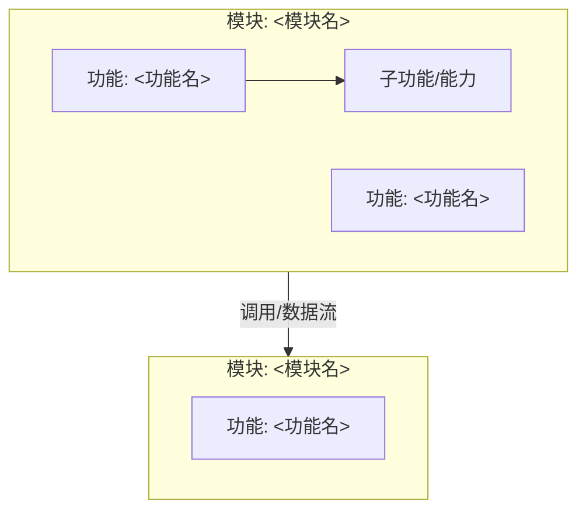
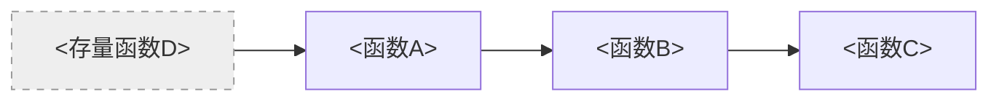

# Functions — <变更名称>

> 函数蓝图 — 编码与测试的输入契约。五段结构：架构图 → 模块结构 → 声明图 → 签名表 → 调用关系图。

---

## 1. 功能架构图



<!-- 图命名约定: architecture-<module>。模块间边标注调用或数据流。 -->

## 2. 模块结构

```
<模块名>
├── <功能名>
│   ├── <函数名>(<参数列表>) → <返回值类型>
│   └── <函数名>(<参数列表>) → <返回值类型>
└── <功能名>
    └── <函数名>(<参数列表>) → <返回值类型>
```

## 3. 函数声明图

```mermaid
classDiagram
    class <类名> {
        +<函数名>(<参数>: <类型>): <返回类型>
        +<函数名>(<参数>: <类型>): <返回类型>
    }
```

<!-- 批次归属（由 sdd-plan 划分批次后回写，analyze 阶段留占位）:
  - 每个类/函数声明上方批注: `批次: <plan 阶段回填>`（回写为实际批次号 N）
  - 被后续批次修改的函数标 `(M)`
-->

## 4. 函数签名表

### 模块：<模块名>

#### 功能：<功能名>

##### <函数名>

- **批次**: `<plan 阶段回填>`（sdd-plan 回写为实际批次；(M)=后续批次修改）
- **参数列表**:
  - `param1: Type1` — 参数描述
  - `param2?: Type2` — 可选参数描述
- **返回值**: `ReturnType` — 返回值描述
- **描述**: 函数行为描述
- **所属模块**: `<模块名>/<功能名>`

## 5. 调用关系图



<!-- 存量节点（非本变更新增/修改）用 classDef existing 灰虚线标注，不展开其内部。 -->

## 调用链（文本保留，机器可读）

- **链路 1**: `<函数A>` → `<函数B>` → `<函数C>`
- **链路 2**: `<存量函数D>` → `<函数A>` → `<函数B>`
